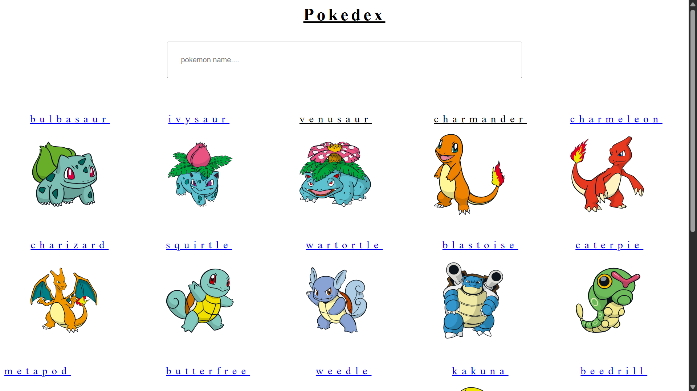
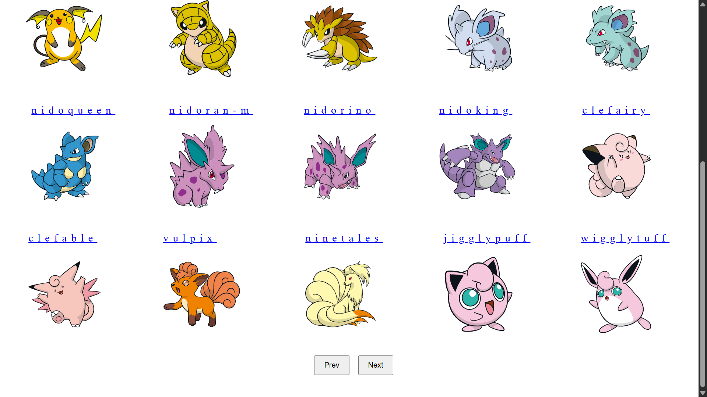
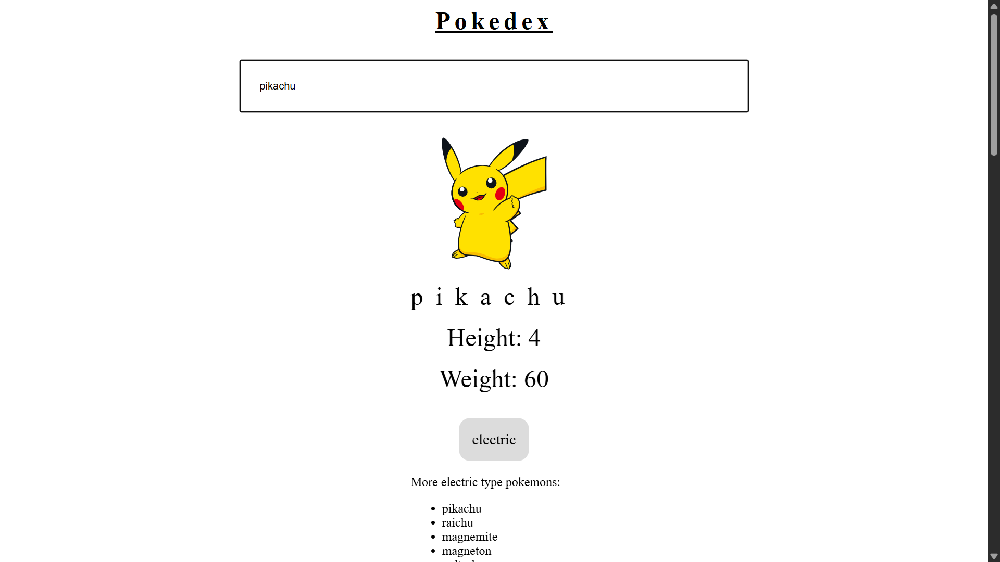

# 🐾 Pokedex Web App

## 📌 Overview

A simple and interactive Pokédex web application built using Vite + React. It fetches real-time data from a public API and displays multiple Pokémon with their stats, types, and images in a clean and responsive UI.

---

## 🚀 Features

* 🔍 Browse multiple Pokémon
* 📊 View stats and types
* 🖼️ High-quality Pokémon images
* ⚡ Fast performance with Vite
* 📱 Responsive and user-friendly UI

---

## 🛠 Tech Stack

* React.js
* Vite
* JavaScript
* CSS
* REST API

---

## 🔗 Live Demo

https://pokedex-tan-nine-43.vercel.app/

---

## 📸 Screenshots







---

## ⚙️ Installation

```bash
git clone https://github.com/Deepak7200/Pokedex-Web-App.git
cd Pokedex-Web-App
npm install
npm run dev
```

---

## 🌐 API Used

* PokéAPI (https://pokeapi.co/)

---

## 📂 Project Structure

```bash
src/
├── components/
├── pages/
├── App.jsx
├── main.jsx
```

---

## 👨‍💻 Author

Deepak Singh Sehrawat
